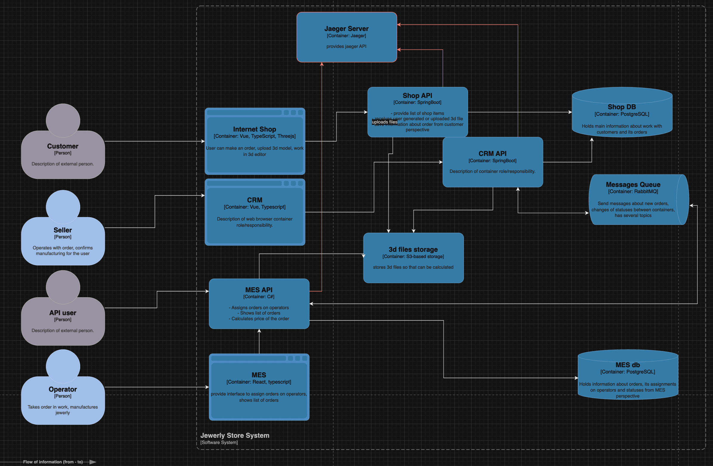

Участки трейсинга:
    Shop API
        необходимые данные:
        - идентификатор пользователя, идентификатор заказа, статус заказа
        - метаданные загруженной модели в связи с заказом
    CRM API
        необходимые данные:
        - идентификатор продавца, идентификатор заказа, статус заказа, дата изменения статуса заказа
    MES API
        необходимые данные:
        - идентификатор внешнего пользователя API (B2B), идентификатор заказа, статус заказа
        - метаданные загруженной модели в связи с заказом от внешнего пользователя
        - идентификатор оператора, номер заказа, статус заказа, время изменения статуса заказа

Мотивация:
    В системе явно обозначена проблема "потери заказа", что в техническом смысле из себя представляет 
        невозможность проследить цепочку изменения состояния заказа и выстроить на ее основе 
        набор правил для предупреждений, а так же идентификации конкертного узкого участка системы.
    С внедрением трейсинга разработчики и поддержка смогут следить за заказом не как за отдельным набором
        данных, а как за последовательностью событий бизнес-сценария, восстанавливая его историю от начала и до конца,
        затрачивая на это минимум усилий, а значит:
            - сократится время разбора инцидентов
            - появится возможность предпринять действия для исправления узких мест
            - повысится позитивный пользовательский опыт
Предлагаемое решение:
    Необходимо создать сервер jaeger.
    Необходимо в *-API сервисы добавить зависимость opentelemetry и настроить взаимодействие с jaeger.
    Необходимо в *-API сервисах настроить поставляемые трейсы.
    

Компромиссы:
    Трейсинг в вакууме не является абсолютным решением: необходима либо автоматизация сценариев мониторинга(более эффективно, так как
        о проблеме можно узнать до жалобы пользователя), либо необходим сотрудник, который будет глазами и руками решать проблемы
        по мере их поступления(что снижает негативный опыт очень незначительно)

Безопасность:
    Доступ к системе должен иметь только технический персонал(девопс, разработчики). В идеале внедрение сотрудников поддержки, тогда
        доступ должен быть выдан и им.

