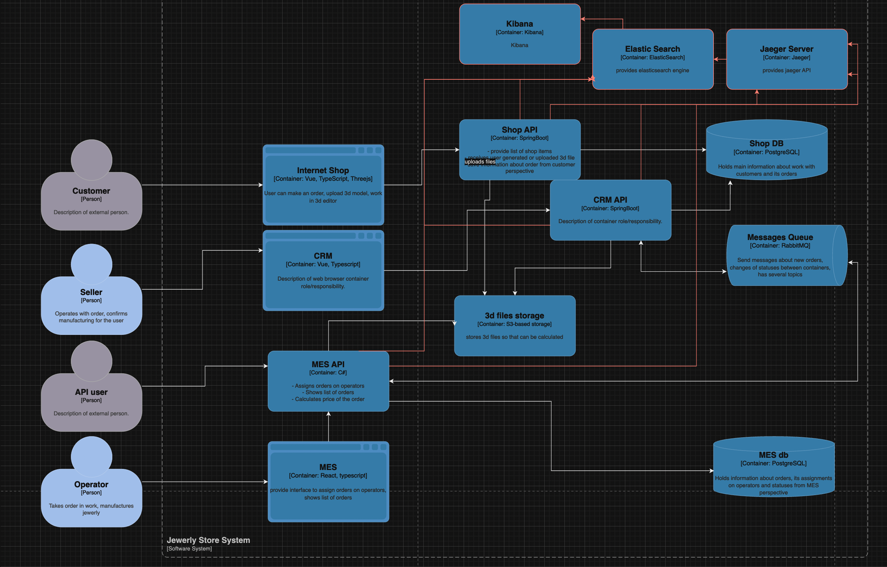

Общее правило для логирования приложений:
    Уровень INFO: должен логироваться каждый метод/функция, которые можно выделить в единый логический
        элемент в разрезе бизнес-функционала. Примеры:
            - Сохранение заказа
            - Отправка модели
            - Присвоение оператору заказа и т.д.
        Смысл логов такого уровня - при наличии вопросов и/или инцидентов, иметь возможность проследить состояние системы в момент выполнения.
        Следовательно, при выборе логируемых данных, отталкиваться от двух вещей:
        - данные не чувствительные (не пароли, персональные данные)
        - данные позволят сложить преставление о произошедшем событии
        
    Уровень DEBUG:
        В системе замечено увеличение дефектов уровня high/highest, поэтому для упрощения процесса тестирования имеет смысл также
    добавить логи уровня DEBUG для приложений, работающих в dev окружении(либо включаемые по требованию). 
    Общим правилом таких логов может стать лог о входных значениях КАЖДОЙ разработанной функции приложения, а так же лог с выходными
        значениями. При наличии ветвления в коде добавлять лог с указанием сработавшего условия ветвления.

Мотивация:
    Логирование может работать независимо от трейсинга, но их комбинация даст наибольшую эффективность. 
    Наличие логов системы и удобного средства работы с ними (Kibana) позволит по минимальным наборам данных в ручном
        режиме отслеживать произошедшие в системе события в отношении этих данных. Например, по идентификатору заказа можно будет узнать
        когда задание было создано, сколько длилась загрузка 3д-модели, как много времени занял переход от создания заказа до его взятия оператором,
        как долго оператор выполнял задание. Также можно будет понять на каком конкертно этапе остановился бизнес-процесс при отсутствии 
        логов, которые должны были бы оказаться в системе при ее корректной работе.
    Приоритет критичности внедрения трейсинга(от высшего к низшему):
        - MES API
        - CRM API
        - Shop API
    
    Логика приоритизации следующая: MES API является точкой, куда поступают B2B заказы. Также именно в нем происходит назначение
        заказов на оператора и все изменения статусов уже принятого заказа.
    Далее следует участок принятия заказа продавцами и непосредственно создание заказа: компания не сталкивается с проблемой созданий заказов,
        но сталкивается с проблемами их обработки и завершения, поэтому эти участки являются менее критичными.

Предлагаемое решение:
    Логирование на уровне приложения выполняется:
        java: logback
        c#: Serilog
    Хранилище логов: elasticsearch
    визуализация логов: kibana
    экспортер логов: logstash

    Логи не должны отображать чувствительную информацию (пароли, личные данные) - данные необходимо либо исключать, либо маскировать.
    Доступ к логам на проде должны иметь только разработчики и поддержка.
    
    Политику хранения логов необходимо выработать, отталкиваясь от того, сколько в среднем проходит времени, прежде чем пользователь 
        создает обращение с жалобой о задержке сроков. Без понимания этого времени строить конкертные требования к хранению логов пока кажется бессмысленным. Далее, если это число выходит слишком большим, необходимо приходить к компромиссам: например, к минимизации количества и размера логируемого сообщения для более компактного их хранения.

    Смысла выстраивать из системы логирования полноценную систему их анализа не видится необходимым, на данном этапе лучше прибегать к логам только как инструменту разрешения инцидентов с заказами и идентификации ошибок работы системы. 

