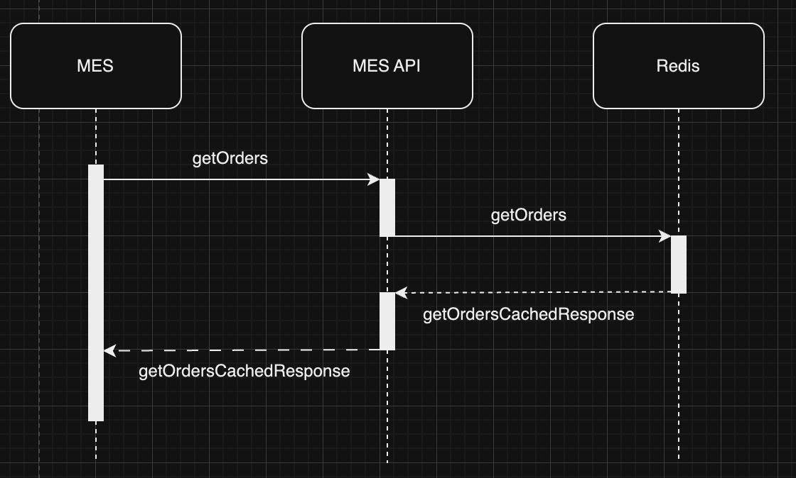
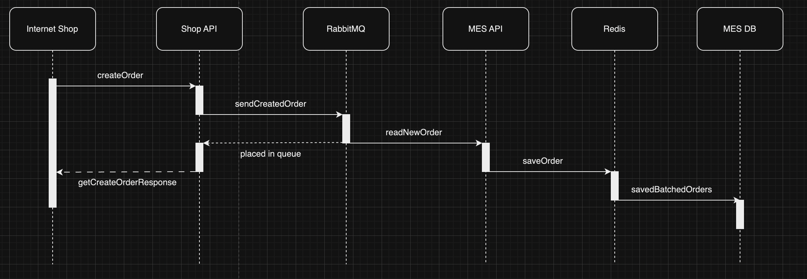

Мотивация:
    Кеширование позволит снизить нагрузку на базы данных при помощи подготовки запрашиваемых операторами данных прямо в момент создания
        строки, подготовленной для вставки в БД посредством стратегии Write-Behind. Решение это проблемы подразумевает внедрение системы
        кеширования, однако сразу после подключения кеша появится возможность быстро подключить кеш для других узких мест системы
        в случае их обнаружения.
    Кешировать пока предлагается только сведения о заказах, готовых к исполнению оператором - таким образом снизится время обработки запросов 
        к MES - приложению не придется ждать ответа от и без того нагруженной БД, занимая CPU.

Предлагаемое решение:
    Необходимо внедрить серверное кеширование для MES API стратегией Write-Behind.
    Применение этого паттерна обусловлено тем, что оператору необходим кратчайший срок получения наиболее актуальных заказов - 
        таким образом мы позволим ему увидеть список свежих заказов прямо в момент их создания, не нагружая при этом излишне БД как
        записью(запись будет происходить на стороне системы кеширования пачками), так и чтениями(операторы регулярно обновляют страницу
        в поисках нового заказа).
    
    Диаграмма последовательности размещения заказа:

  
    Диаграмма последовательности отображения списка заказов:

    Redis здесь является прямым источником данных для MES API, поэтому инвалидация существующих записей должна происходить при их смене.
    Например, при изменении статуса заказа меняются данные сущности, а значит предыдущая запись по обрабатываемому ID должна быть инвалидирована
    в пользу записи с новым состоянием. 

